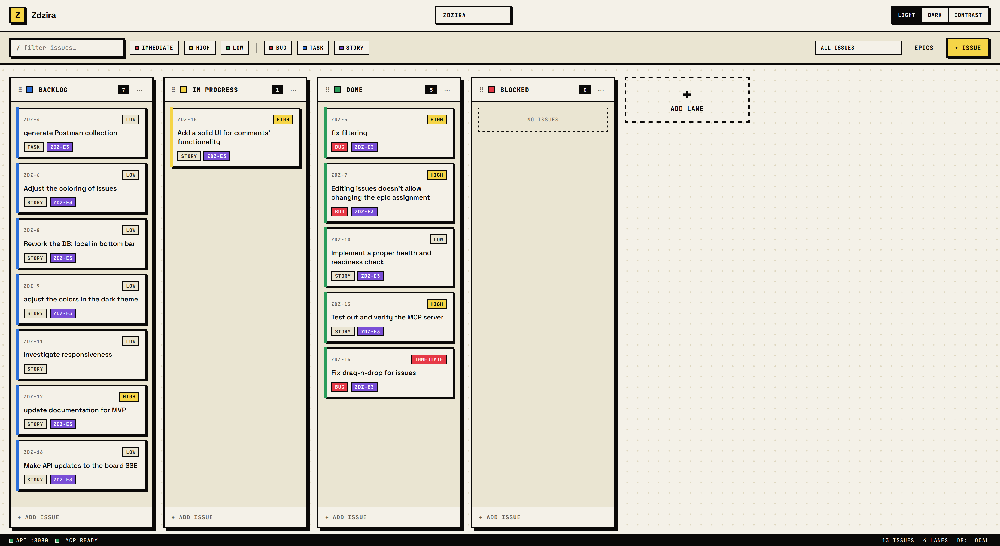
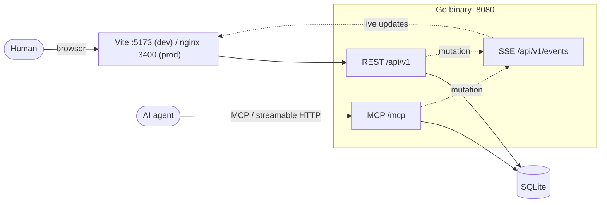
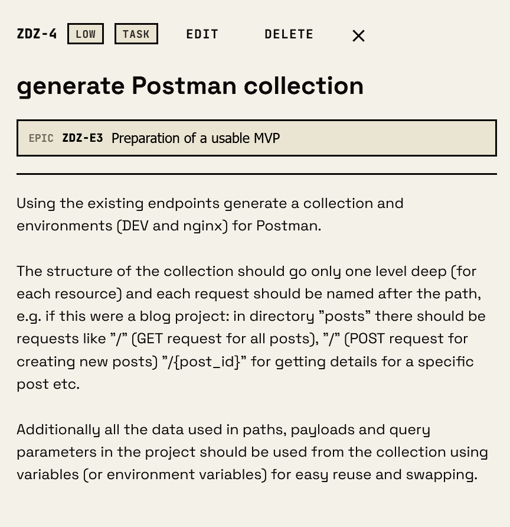
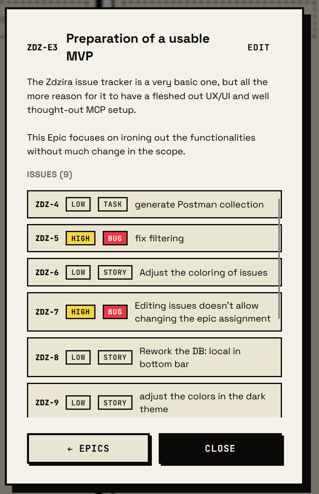

# Zdzira

A local issue tracker for personal software development in the AI age. No accounts, no auth — access is direct.
It exposes a **REST API** for humans and an **MCP server** for AI agents (Claude Code, Claude Desktop), running as a
single Go binary backed by SQLite.



## Features

- Kanban board with drag-and-drop lanes and issues (Task / Bug / Story, priorities, epic grouping)
- Comments and directed links (Blocks, Duplicates, Relates To, Is Part Of) on issues
- Filtering by type, priority, epic, and free-text search; light / dark / high-contrast themes
- Real-time board sync via Server-Sent Events — agent changes appear without a refresh
- MCP server so AI agents work the board directly

## Architecture

One Go binary serves both interfaces over a single SQLite database. A mutation from either side is broadcast to open
browsers via SSE, so an agent moving an issue updates the board live.



Details: [`backend/README.md`](backend/README.md) · [`frontend/README.md`](frontend/README.md) ·
domain glossary [`CONTEXT.md`](CONTEXT.md) · data model [`docs/erd.md`](docs/erd.md).

## Quick start

```sh
go build -o bin/zdzira ./cmd/zdzira && ./bin/zdzira   # serves on :8080, db at ./zdzira.db
```

Or with Docker:

```sh
docker compose up                              # dev: frontend :5173, backend :8080 (Vite HMR)
docker compose -f docker-compose.yml up --build # prod: app on :3400 (nginx)
```

## MCP setup

The MCP server runs at **`/mcp`** over streamable HTTP. The one thing that matters: **point Claude at a URL reachable
from where Claude's *process* runs** — which is not always the URL your browser uses.

**Claude Code (CLI)** — add the server with the URL for your setup (see table below):

```sh
claude mcp add --transport http zdzira http://localhost:8080/mcp
```

Or in your project's `.claude/settings.json`:

```json
{ "mcpServers": { "zdzira": { "type": "http", "url": "http://localhost:8080/mcp" } } }
```

**Claude Desktop** — in `claude_desktop_config.json`, same `url` rules apply:

```json
{ "mcpServers": { "zdzira": { "url": "http://localhost:8080/mcp" } } }
```

### Which URL?

| Where Claude runs | Where the backend runs | URL |
|---|---|---|
| On your host (native Linux/macOS) | host or Docker (port 8080 published) | `http://localhost:8080/mcp` |
| Inside a container | backend in Docker, port 8080 published | `http://host.docker.internal:8080/mcp` |

`host.docker.internal` is needed because Claude's container is **not** on this project's Docker network (it would mean
editing this repo's compose), so it reaches the backend via the host's published port, not the `backend` service name.

> **WSL caveat — don't assume what works in the browser works for Claude.** With the backend on WSL, your Windows
> browser reaches `localhost:8080`, but a Docker container generally **cannot** reach a WSL-hosted process through
> `localhost` or reliably through `host.docker.internal`. If Claude runs in a container, run the **backend in Docker
> too** (so its published port is reachable via `host.docker.internal`), or target the backend's WSL IP. Always verify
> reachability from Claude's own environment — e.g. `curl http://host.docker.internal:8080/health` should return
> `{"status":"ok"}` before trusting the MCP config.

See [`backend/README.md`](backend/README.md) for the MCP tool list and the full REST endpoint reference.

## API & Postman

- Live OpenAPI docs: `http://localhost:8080/docs` · committed snapshot: [`docs/openapi.json`](docs/openapi.json) (`make openapi`)
- Postman collection + DEV/Nginx environments: [`docs/`](docs) — full endpoint reference is in [`backend/README.md`](backend/README.md)

## Screenshots



