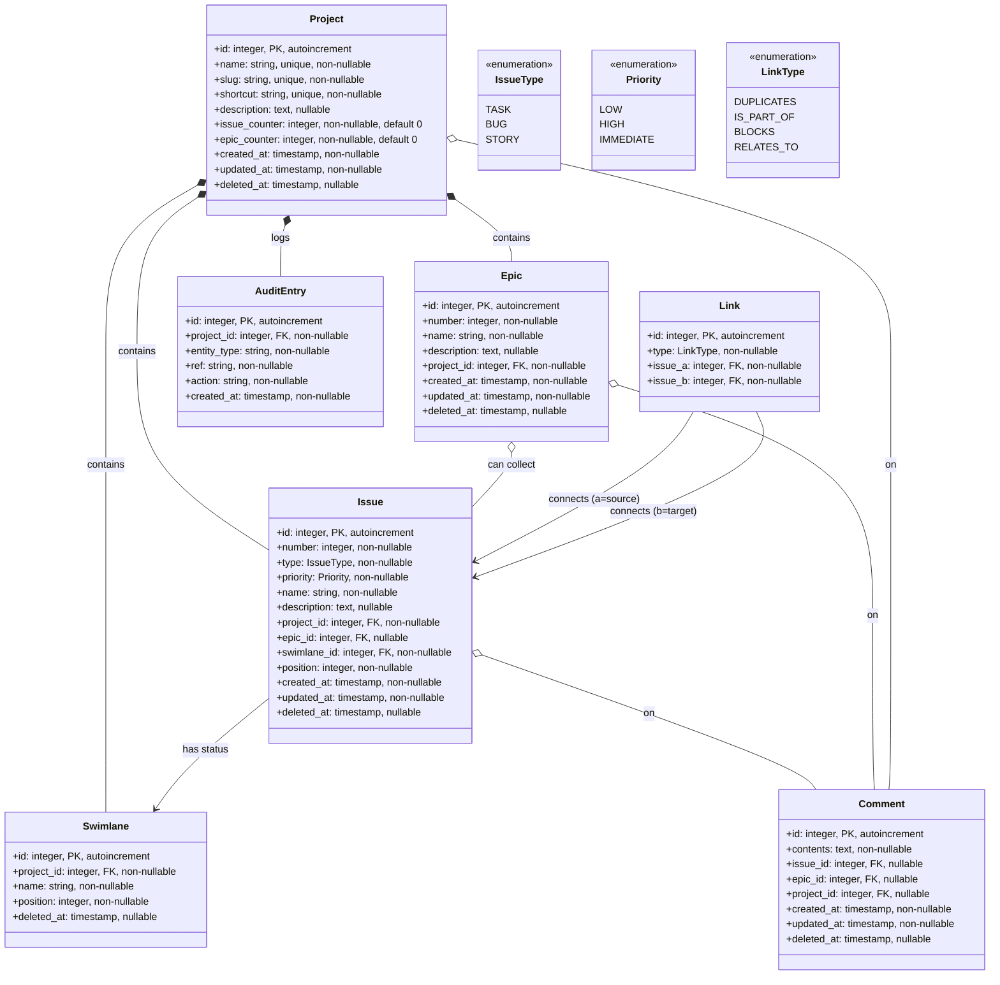

# Entity-relations diagram

## Constraints

- `Comment`: exactly one of `issue_id`, `epic_id`, `project_id` is non-null (check constraint)
- `Link`: `issue_a` = source, `issue_b` = target for directed types (`BLOCKS`, `IS_PART_OF`)
- `Issue.position`: creation order within swimlane, not manually reorderable
- `Swimlane`: seeded with `Backlog → In Progress → Done` on project creation
- Soft delete (`deleted_at`) on all entities except `Link` and `AuditEntry`; project deletion cascades to all owned entities
- `AuditEntry`: append-only, no `updated_at` or `deleted_at`; `entity_type` ∈ {"issue", "epic"}, `action` ∈ {"created", "updated", "moved", "deleted"}
- `AuditEntry` is REST-only — not exposed via MCP (see ADR 0004)
